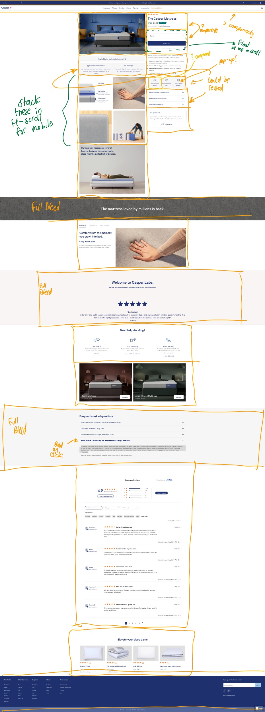

Hey folks,

Took a crack at this by basically looking at the website, recognizing it was a pretty standard bunch of sales style components, and printed out a version of the page to get breaking down the components on. Once I broke down the components, I built them from top-to-bottom in order.

I built the project using the latest version of Next.js with the modern app router. Stylization was all done with Tailwind CSS for quickness and easy generation and replicability. I am hosting the project on Vercel.

There were some features I ran out of time on. There should be a modal popup on the right column 3-set of icons for each icon. I didn't implement any cart functionality. On mobile, the four images in my image grid should be added to a horizontal scroll on the main product image. On scroll of the page, the Product Size and cart functionality should float at the top of the page sticky-like so the user can add to cart from anywhere on the page. I left out some of the detail on the folks reviews as well. This was all of this was basically just timing and prioritizing. Wanted to focus on making a full front-end representation of the page.

There were also some decisions I ended up not being able to make, but wanting to make. Stuff like the icons - would be really easy to just make an icon component with optional text below and above it, and you could just drop that in in a lot of the icon spaces. Same thought with the accordion - really easy to just pass in some parameters to a generic component to have that customizable and reduce repeated code. I also feel this way about the rich text stuff and the callouts in general. In an environment I owned I'd want that all to be more flexible :)

Thanks gang!

